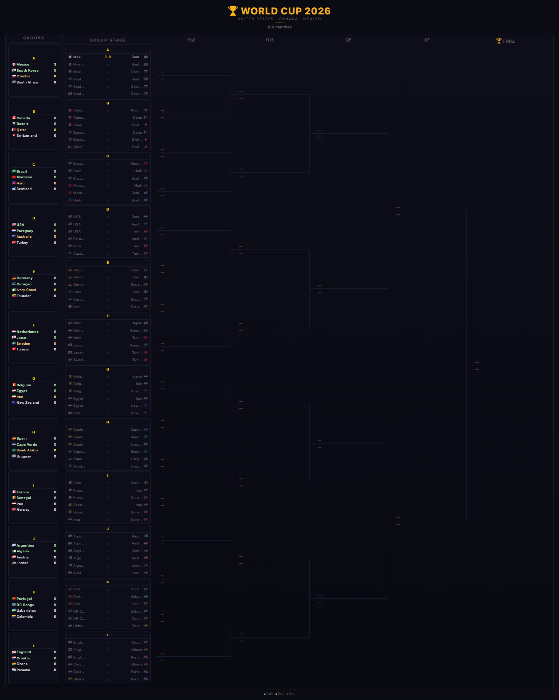

# ⚽ World Cup 2026 — Live Knockout Bracket

A **live, auto-updating** knockout bracket and group stage tracker for the FIFA World Cup 2026 (United States • Canada • Mexico).

👉 **[Live Demo → https://imp.cx/bracket.html](https://imp.cx/bracket.html)**



---

## Features

- **Group Standings** — All 12 groups (A–L) with points, qualification status (Adv / 3rd / Out)
- **Group Stage Matchups** — Every round-robin game (6 per group) with live scores
- **Knockout Bracket** — R32 → R16 → QF → SF → 🏆 Final (appears when groups complete)
- **Auto-Update** — Fetches fresh data from `worldcup26.ir` on every load
- **Mobile Friendly** — Horizontal scroll on mobile, dark mode

## How it works

Data is pulled from [worldcup26.ir](https://worldcup26.ir) via a Cloudflare Worker proxy. No API keys needed. Just open the page and scores appear as matches finish.

The 2026 format: 12 groups of 4 (round-robin) → top 2 per group + 8 best 3rd-placed teams advance to R32.

## Tech

- Vanilla HTML/CSS/JS — no build step
- [bracketry](https://github.com/sarmis/bracketry) library for SVG bracket rendering
- Cloudflare Worker for CORS proxy
- GitHub Pages hosting

## Run locally

```bash
git clone https://github.com/LIONBABYCRYPTO/worldcup-2026-bracket.git
# Open index.html directly or serve with any static server
python3 -m http.server 8080
```

## Credits

Data: [worldcup26.ir](https://worldcup26.ir) · Built by [@LIONBABYCRYPTO](https://github.com/LIONBABYCRYPTO)
